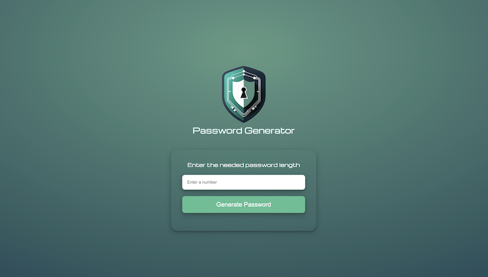
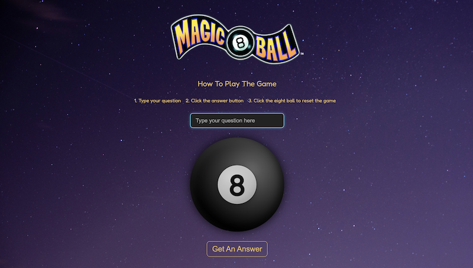

# 💻 Personal Projects

This repository contains my personal web development projects. These projects are created for practice, experimentation, and to showcase my skills in HTML, CSS, and JavaScript.

---

## 🔐 Password Generator

**Tech Stack:** HTML | CSS | JavaScript

  

A simple web app that generates secure, random passwords based on user-specified length. Features include:

- Customizable password length (5–20 characters)
- Mix of uppercase, lowercase, numbers, and symbols
- Responsive design for desktop and mobile
- Error handling for invalid input

[Project Folder](./password-generator) | [Live Demo](https://NathanRayM.github.io/personal-projects/password-generator/) | [Repo](https://github.com/NathanRayM/personal-projects)

---

## 🎱 Magic 8 Ball Game

**Tech Stack:** HTML | CSS | JavaScript

  

A fun, interactive web app built with HTML, CSS, and JavaScript. Inspired by the classic fortune-telling toy.

- Interactive input – type a question and receive a random yes/no-style answer
- Realistic 8-Ball design: inner circle gradients and shadows simulate depth and lighting
- Responsive design for desktop and mobile

[Project Folder](./magic-8-ball-game) | [Live Demo](https://NathanRayM.github.io/personal-projects/magic-8-ball-game/) | [Repo](https://github.com/NathanRayM/personal-projects)

---

## License

This repository is open source and available under the [MIT License](LICENSE).
