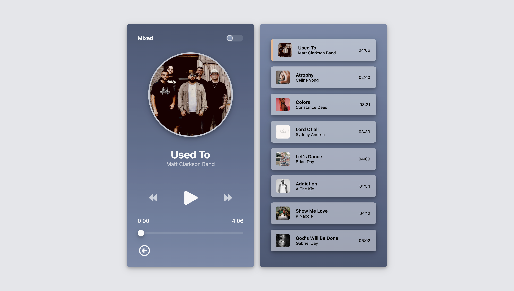

# Mix Engineer A/B Audio Player

This repository contains a custom-built audio player designed specifically for audio engineers and producers. The goal of this project is to provide a practical, real-world tool for comparing **unmixed vs mixed audio** using an intuitive A/B workflow — while also showcasing modern front-end development skills.

## Project Overview

### Mix Engineer A/B Audio Player

The Mix Engineer A/B Audio Player is a responsive, JavaScript-driven web audio player that allows users to seamlessly switch between two versions of the same track (A/B comparison) without losing playback position.

This project emphasizes **state management**, **media APIs**, and **user-focused UI design**, closely mirroring real tools used in professional audio workflows.

### Key Features

- **A/B Audio Comparison** – Instantly switch between mixed and unmixed versions of a song while preserving playback time.
- **Custom Audio Player Controls** – Play, pause, previous, next, auto-advance, and seek functionality built from scratch.
- **Dynamic Playlist System** – Clickable playlist with active track highlighting and visual feedback.
- **Smooth Progress Tracking** – Real-time playback progress with drag-to-seek support.
- **Responsive Layout** – Mobile-first design with adaptive layout for larger screens.
- **Polished UI/UX** – Subtle animations, gradients, shadows, and hover/focus states inspired by modern audio software.
- **Scalable Data Structure** – Song data structured to support future migration to JSON for easy customization.

This project demonstrates advanced DOM manipulation, event handling, audio state synchronization, and thoughtful component architecture — making it a strong portfolio piece for real-world front-end applications.

[Project Folder](./mix-engineer-ab-player) | [Live Demo](https://NathanRayM.github.io/personal-projects/mix-engineer-ab-player/) | [Repo](https://github.com/NathanRayM/personal-projects)

## Tech Stack

## License

This repository is open source and available under the [MIT License](LICENSE).
