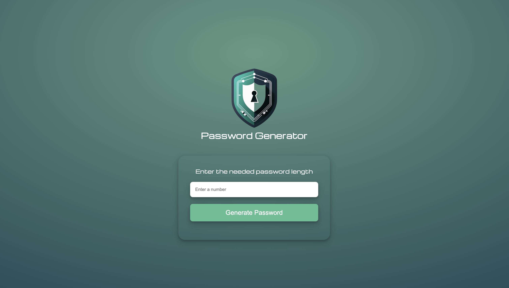

# Password Generator

## Description

A simple, responsive password generator that creates secure passwords of user-defined length. This project allows you to quickly generate random passwords including letters, numbers, and symbols.

---

## Screenshot

---

## Features

- Generate random passwords with letters, numbers, and symbols
- User-specified password length (5-20 characters)
- Responsive design for both desktop and mobile
- Clear error messages for invalid input

---

## How to Use

1. Open `index.html` in your browser.
2. Enter the desired password length in the input field (between 5 and 20).
3. Click the **Generate Password** button.
4. The generated password will appear below the button. Copy it for use.

---

## Tech Stack

- HTML5
- CSS3
- JavaScript (ES6+)

---

## License

This project is open source and available under the [MIT License](LICENSE).
